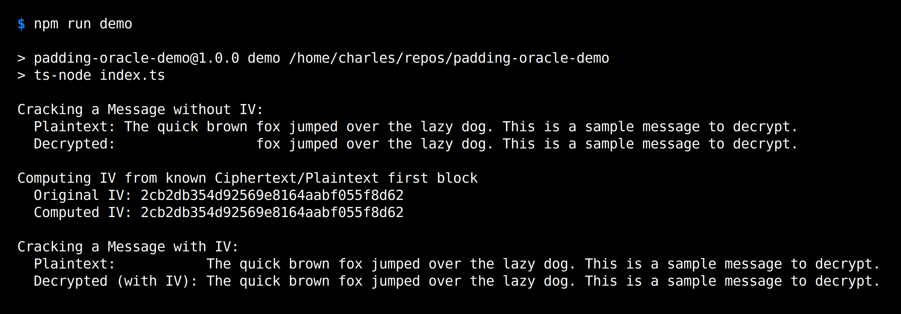

# Padding Oracle Demo

A TypeScript demonstration of a [Padding Oracle Attack](https://robertheaton.com/2013/07/29/padding-oracle-attack/).

It can decrypt all but the first block of encrypted data using only a padding oracle. If the first blocks of a ciphertext/plaintext pair is known, the IV can be computed, which can be used for full decryption of other messages.

Run `npm install` to install dependencies and then `npm run demo` to run the demo, or just `ts-node index.ts` if you already have `ts-node` globally installed. I know it may seem pointless only having TypeScript as a dependency, but hey, I like [TypeScript](https://www.typescriptlang.org/).

Output when run:

